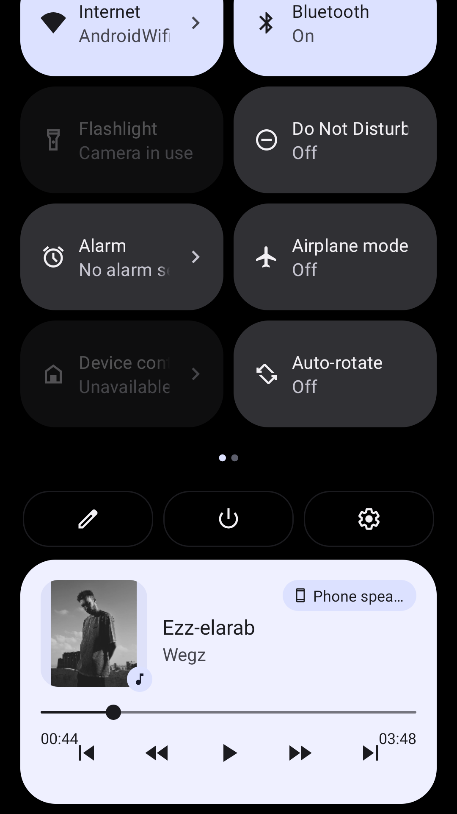

## Music-Player
A music player application that plays songs which are uploaded to firebase. Users can easily control the playback of songs, including play, pause, next, and previous or seek to specific position. 
The application also displays information about the currently playing song, such as title, artist, album, and album artwork.

## Implemented using
* Exoplayer for handling audio playback
* Firestore to store the songs in collection
* Viewpager2 to swiping through songs
* Music Notification manager that allows users to control the behavior of their music app's notification when minimizing the app
* Dagger-hilt for dependency injection
* Navigation component
* Coroutines
* MVVM architecture
* Exoplayer

## Screens

  
   
  
                                            

 
